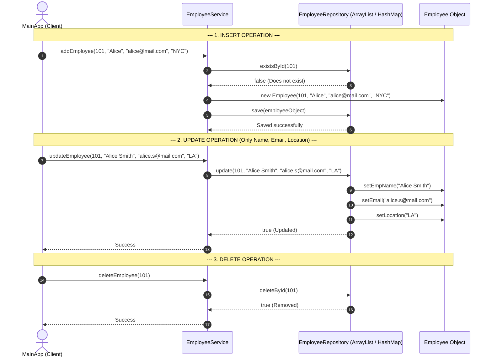

# Java Employee Management System — Architecture, Function Flow & OOP Guide

Welcome! This guide explains **how every class and function works**, **the difference between `static` and `non-static` (instance) elements**, **how data flows through the application**, and **why this design architecture is used in professional software development**.

---

## 1. Fundamentals: Static vs Non-Static (Instance)

Before diving into the code, let's clarify two foundational concepts in Java:

| Feature | Non-Static (Instance) | Static |
| :--- | :--- | :--- |
| **Belongs To** | An **individual object** created using `new`. | The **class itself**. Shared by everything. |
| **State / Data** | Each object has its **own copy** of variables (e.g., Employee #101 has name "Alice", Employee #102 has name "Bob"). | Only **one single copy** exists in memory across the entire program. |
| **When to Use** | When data or behavior depends on specific instance data (e.g., updating an employee's email). | For utility methods (like `Math.sqrt()` or `main()`) or constants that don't belong to a specific object. |

---

## 2. Architecture Overview: The 4 Layers

Instead of putting all Java code into one huge file, we divide the project into **4 distinct layers**:

```
+-------------------------------------------------------+
|  1. APP LAYER (MainApp.java)                          |  <-- Entry point, orchestrates execution
+-------------------------------------------------------+
                           |
                           v
+-------------------------------------------------------+
|  2. SERVICE LAYER (EmployeeService.java)             |  <-- Business rules & validation
+-------------------------------------------------------+
                           |
                           v
+-------------------------------------------------------+
|  3. REPOSITORY LAYER (EmployeeRepository Interface)  |  <-- Storage contract (ArrayList / HashMap)
+-------------------------------------------------------+
                           |
                           v
+-------------------------------------------------------+
|  4. MODEL LAYER (Employee.java)                       |  <-- Data template (Blueprint)
+-------------------------------------------------------+
```

---

## 3. Class-by-Class Map & Method Reference

Here is a complete breakdown of every class, field, and method in the application:

### A. Model Layer: `Employee.java`
- **Purpose**: Represents a single employee in memory. Holds the template for employee data.

| Member Name | Type | Modifier | Responsibility / Description |
| :--- | :--- | :--- | :--- |
| `empNo` | Variable | `non-static` (`final`) | Unique identifier. Marked `final` so it cannot be changed after creation. |
| `empName` | Variable | `non-static` | Employee's full name. |
| `email` | Variable | `non-static` | Employee's email address. |
| `location` | Variable | `non-static` | Employee's work location. |
| `Employee(...)` | Constructor | `non-static` | Initializes a new `Employee` instance with all 4 fields. |
| `getEmpNo()` | Method | `non-static` | Returns the employee number. |
| `getEmpName()` / `setEmpName()` | Method | `non-static` | Reads / modifies `empName`. |
| `getEmail()` / `setEmail()` | Method | `non-static` | Reads / modifies `email`. |
| `getLocation()` / `setLocation()`| Method | `non-static` | Reads / modifies `location`. |
| `toString()` | Method | `non-static` | Formats employee information into a readable String for printing. |
| `equals()` & `hashCode()` | Method | `non-static` | Allows comparing two `Employee` objects based on `empNo`. |

> **Note**: There is **no `setEmpNo(...)` method**! This enforces the rule that `empNo` is immutable (cannot be changed once an employee is created).

---

### B. Repository Layer: Interface & Implementations

#### 1. `EmployeeRepository.java` (Interface)
- **Purpose**: A contract defining *what* storage operations must exist, without specifying *how* they are stored.

| Method Signature | Return Type | Modifier | Responsibility |
| :--- | :--- | :--- | :--- |
| `save(Employee employee)` | `void` | Abstract (`non-static`) | Inserts an employee into storage. |
| `findById(int empNo)` | `Optional<Employee>` | Abstract (`non-static`) | Searches storage for an employee by `empNo`. |
| `findAll()` | `List<Employee>` | Abstract (`non-static`) | Retrieves all stored employees. |
| `update(int empNo, String name, String email, String loc)` | `boolean` | Abstract (`non-static`) | Updates mutable attributes if employee exists. |
| `deleteById(int empNo)` | `boolean` | Abstract (`non-static`) | Removes employee from storage. |
| `existsById(int empNo)` | `boolean` | Abstract (`non-static`) | Returns `true` if employee exists. |

#### 2. `EmployeeArrayListRepository.java` (Concrete Implementation)
- **Purpose**: Stores employees inside a Java `ArrayList<Employee>`.

| Variable / Method | Type / Return | Modifier | Responsibility |
| :--- | :--- | :--- | :--- |
| `employeeList` | Variable | `non-static` (`private final List<Employee>`) | Internal `ArrayList` instance holding employee objects. |
| `save(employee)` | Method | `non-static` | Executes `employeeList.add(employee)`. |
| `findById(empNo)` | Method | `non-static` | Loops through `ArrayList` to find matching `empNo`. |
| `findAll()` | Method | `non-static` | Returns a copy of `employeeList`. |
| `update(...)` | Method | `non-static` | Finds employee in `ArrayList` and calls setters for `empName`, `email`, and `location`. |
| `deleteById(empNo)` | Method | `non-static` | Executes `employeeList.removeIf(...)`. |
| `existsById(empNo)` | Method | `non-static` | Checks if any item in `ArrayList` matches `empNo`. |

#### 3. `EmployeeHashMapRepository.java` (Concrete Implementation)
- **Purpose**: Stores employees inside a Java `HashMap<Integer, Employee>` where key is `empNo`.

| Variable / Method | Type / Return | Modifier | Responsibility |
| :--- | :--- | :--- | :--- |
| `employeeMap` | Variable | `non-static` (`private final Map<Integer, Employee>`) | Internal `HashMap` instance storing `(empNo -> Employee)`. |
| `save(employee)` | Method | `non-static` | Executes `employeeMap.put(employee.getEmpNo(), employee)`. |
| `findById(empNo)` | Method | `non-static` | Direct O(1) key lookup via `employeeMap.get(empNo)`. |
| `findAll()` | Method | `non-static` | Returns `new ArrayList<>(employeeMap.values())`. |
| `update(...)` | Method | `non-static` | Fetches object via key and modifies attributes using setters. |
| `deleteById(empNo)` | Method | `non-static` | Executes `employeeMap.remove(empNo)`. |
| `existsById(empNo)` | Method | `non-static` | Direct O(1) key check via `employeeMap.containsKey(empNo)`. |

---

### C. Service Layer: `EmployeeService.java`
- **Purpose**: Contains the business logic, validation rules, and error handling.

| Member Name | Type / Return | Modifier | Responsibility |
| :--- | :--- | :--- | :--- |
| `repository` | Variable | `non-static` (`private final EmployeeRepository`) | Reference to whichever repository implementation is passed in. |
| `EmployeeService(repository)` | Constructor | `non-static` | **Dependency Injection**: Receives `EmployeeArrayListRepository` or `EmployeeHashMapRepository`. |
| `addEmployee(empNo, name, email, loc)` | Method | `non-static` | Checks if `empNo` exists. If yes, throws `DuplicateEmployeeException`. Otherwise creates `Employee` object and calls `repository.save()`. |
| `getAllEmployees()` | Method | `List<Employee>` | Calls `repository.findAll()`. |
| `getEmployeeById(empNo)` | Method | `Employee` | Calls `repository.findById()`. Throws `EmployeeNotFoundException` if missing. |
| `updateEmployee(empNo, name, email, loc)` | Method | `void` | Calls `repository.update()`. Throws `EmployeeNotFoundException` if `empNo` doesn't exist. |
| `deleteEmployee(empNo)` | Method | `void` | Calls `repository.deleteById()`. Throws `EmployeeNotFoundException` if `empNo` doesn't exist. |

---

### D. Application Entry Point: `MainApp.java`
- **Purpose**: The starting point of the application. It creates objects and runs the workflow.

| Member Name | Type / Return | Modifier | Responsibility |
| :--- | :--- | :--- | :--- |
| `main(String[] args)` | Method | **`static`** | **Java Entry Point**. Called directly by Java Virtual Machine (JVM) when program launches. |
| `runCrudDemo(service, storageType)` | Method | **`static`** | Helper method to perform Insert, View All, Update, Delete operations on a given `EmployeeService`. |
| `printEmployees(list)` | Method | **`static`** | Helper method to print employee lists to console. |

> **Why is `main()` static?**
> The JVM needs to run `main()` *before* any objects have been created. Making it `static` allows the JVM to invoke `MainApp.main(...)` directly without running `new MainApp()`.

---

## 4. Step-by-Step Execution Flow Diagram

Here is how data moves through the classes when a user performs operations:



---

## 5. Detailed Step-by-Step Trace of Each Action

### Scenario A: Adding an Employee (`addEmployee`)
1. **`MainApp`** calls `service.addEmployee(101, "Alice Smith", "alice@example.com", "New York")`.
2. **`EmployeeService`** receives the parameters and first calls `repository.existsById(101)` to prevent duplicates.
3. **`EmployeeArrayListRepository`** (or `HashMapRepository`) checks its storage. If `101` is not found, it returns `false`.
4. **`EmployeeService`** instantiates a new `Employee` object: `new Employee(101, "Alice Smith", ...)` where `empNo = 101` is permanently set.
5. **`EmployeeService`** passes the new `Employee` object to `repository.save(employee)`.
6. **`Repository`** adds it to the internal `ArrayList` (`employeeList.add(employee)`) or `HashMap` (`employeeMap.put(101, employee)`).

---

### Scenario B: Updating an Employee (`updateEmployee`)
1. **`MainApp`** calls `service.updateEmployee(102, "Robert Jones", "robert@example.com", "Los Angeles")`.
2. **`EmployeeService`** calls `repository.update(102, "Robert Jones", "robert@example.com", "Los Angeles")`.
3. **`Repository`** locates the existing `Employee` instance in memory using `102`.
4. **`Repository`** calls non-static setter methods on the retrieved `Employee` instance:
   - `emp.setEmpName("Robert Jones")`
   - `emp.setEmail("robert@example.com")`
   - `emp.setLocation("Los Angeles")`
5. **Notice what is missing**: There is no call to change `empNo`. The original `empNo = 102` stays untouched, guaranteeing data integrity.

---

### Scenario C: Switching Storage from `ArrayList` to `HashMap`

Why is this architecture called **"Loose Coupling"**? Look at how `MainApp.java` switches storage backends:

```java
// STEP 1: Storage using ArrayList
EmployeeRepository arrayListRepo = new EmployeeArrayListRepository();
EmployeeService serviceWithArrayList = new EmployeeService(arrayListRepo);

// STEP 2: Switch to HashMap storage
EmployeeRepository hashMapRepo = new EmployeeHashMapRepository();
EmployeeService serviceWithHashMap = new EmployeeService(hashMapRepo);
```

Notice that:
- **`EmployeeService` did not change a single line of code!**
- **`Employee` model did not change a single line of code!**
- **`MainApp` simply passed a different repository implementation into `EmployeeService`.**

---

## 6. Why is this Architecture Preferred in Real World Projects?

In software engineering, this is known as the **SOLID Architecture / Layered Architecture pattern**. Here is why it is used in modern applications:

### 1. Single Responsibility Principle (SRP)
Each class has **one job and one job only**:
- `Employee.java` -> Holds employee data.
- `EmployeeRepository` -> Stores and fetches data.
- `EmployeeService` -> Enforces business rules and validation.
- `MainApp` -> Handles input/output and starts the program.

### 2. Dependency Inversion Principle (DIP) & Plug-and-Play Flexibility
`EmployeeService` depends on the **interface** (`EmployeeRepository`), not on a concrete class (`EmployeeArrayListRepository`). 

Imagine tomorrow your team decides to store employees in a database like **MySQL**, **MongoDB**, or an **AWS Cloud Service**.
All you need to do is write a new class `EmployeeDatabaseRepository implements EmployeeRepository` and pass it into `EmployeeService`. **Zero business logic changes required!**

### 3. Maintainability & Easy Testing
Because components are separate, you can test `EmployeeService` or `EmployeeArrayListRepository` independently without affecting the rest of the application.
